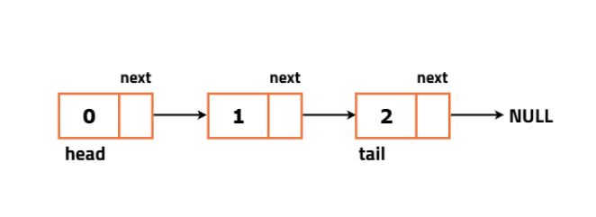

# 1. Creating a Linked List in Java

`main.java`

```java
class Node {
    int data; // contains the value of the node
    Node next; // pointer - which points to the next node in the list.
    // next is also a Node 

    // Constructor with data and next
    Node(int data, Node next) {
        this.data = data;
        this.next = next;
    }

    // Constructor with only data
    Node(int data) {
        this.data = data;
        next = null;
    }
}

public class main {
    public static void main(String[] args) {
        int[] arr = {2, 5, 8, 7};

        // create first node
        Node y = new Node(arr[0]);
        System.out.println(y);       // print memory reference of node
        System.out.println(y.data);  // print data stored in node
    }
}
```

