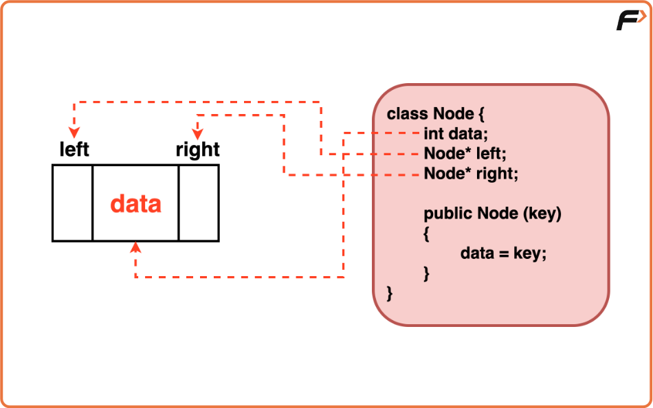
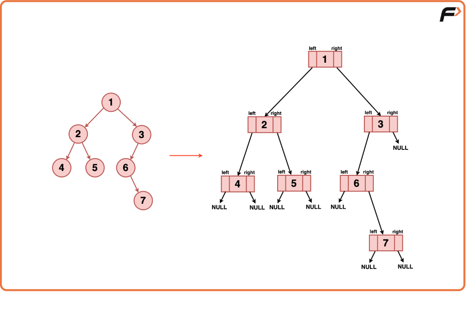
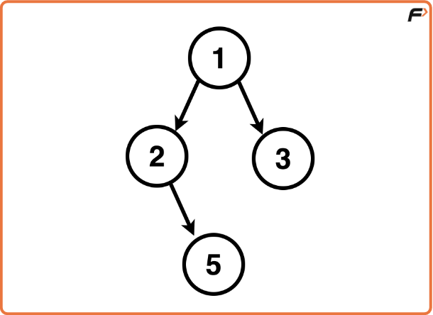

# Binary Tree Representation in Java 

## 1. Core Concepts & Intuition

### How Trees Are Represented in Java
Java does **not** use explicit pointers like `Node*` in C++.  
Instead, Java uses **object references**.

A Binary Tree node in Java contains:
- **data** → the value stored in the node  
- **left** → reference to the left child node  
- **right** → reference to the right child node  

### Node Class Intuition
We define a custom class (usually `Node` or `TreeNode`) to represent one node of the Binary Tree.



When we write:
```java
Node root;
```
**root** stores a reference to the actual node stored in heap memory.

## 2. Visualizing the Structure


Example Tree
```
      1   (root)
     / \
    2   3
   / \
  4   5
```
Node 1 → left → Node 2, right → Node 3

Node 2 → left → Node 4, right → Node 5

Node 3, 4, 5 → left = null, right = null

## 3. Important Observations & Key Points
### Java vs C++
- C++ uses explicit pointers: `Node* root`
- Java uses references automatically: `Node root`
    - No need for *, ->, or &.

#### Default Values
Java automatically sets object references to null, but it recommends writing:

```java
this.left = null;
this.right = null;
```
for clarity.

#### Importance of Root
root is the entry point to the entire Binary Tree.

If you do:
`root = null;`
<br>
→ The whole tree becomes unreachable and will be garbage collected.

#### Empty Tree
If the tree is empty:

`Node root = null;`
<br>

#### Self-Referential Structure
The Node class contains references of its own type:
``` java
Node left;
Node right;
```

#### Memory Allocation
Each new Node(value) call allocates a new object in heap memory.

## 4. Code 
```java
import java.util.*;

// Class representing a Node in the Binary Tree
class Node { 
    int data;       // Stores the value of the node
    Node left;      // Reference to the left child node
    Node right;     // Reference to the right child node

    // Constructor to initialize a node with a given key
    public Node(int key) {
        data = key;     
        left = null;    
        right = null;   
    }
}

// Class containing the logic for Binary Tree creation
class Solution {
    public Node createBinaryTree() {
        // Creates the root node with key value 1
        Node root = new Node(1);       

        // Creates a left child node for the root with key value 2
        root.left = new Node(2);       

        // Creates a right child node for the root with key value 3
        root.right = new Node(3);      

        // Creates a left child node for the right child of root with key value 5
        root.right.left = new Node(5); 

        return root;
    }
}

// Driver class
public class Main {
    public static void main(String[] args) {
        Solution solution = new Solution();
        Node root = solution.createBinaryTree();

        // Tree created, can be used for further operations
    }
}
```


## 5. Summary
- Binary Tree in Java is implemented using a Node class.
- Java uses references, not explicit pointers.
- left and right hold references to child nodes.
- Constructor initializes children to null.
- root is the entry point to the entire tree.
- If root becomes null, the tree becomes unreachable.
- Creating a node → takes O(1) time and memory.
- Node class is self-referential.