# Introduction to Trees

## 1. Core Concepts

### Linear vs Hierarchical Data Structures

**Linear Data Structures**
- Arrays  
- Linked Lists  
- Stacks  
- Queues  
Data is stored **sequentially**.

**Hierarchical Data Structure**
- Trees  
Data is stored in a **hierarchy**, like:
    - Computer folder structure  
    - Organizational charts  
    - Family trees  

### What is a Tree?

A **non-linear data structure** that represents hierarchical relationships between nodes.

Analogy: A root folder contains sub-folders and files → similar to a tree with parent and children.

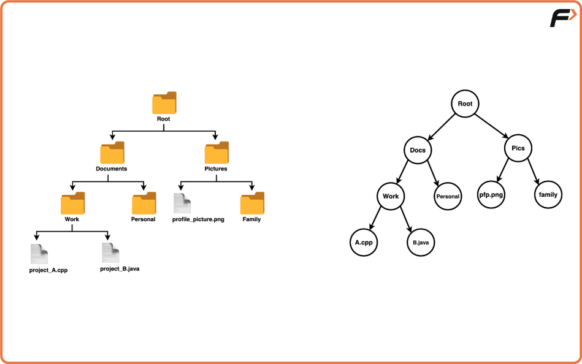

## 2. Tree Terminology

### Root  
The **topmost** node of a tree.

### Children  
Nodes directly connected **downward** from a node.

### Leaf Node  
A node with **no children**.

### Sub-tree  
Any node along with **all its descendants**.

### Ancestors  
All nodes on the path **from a node to the root**  
(parent → grandparent → ...).

---

## 3. What is a Binary Tree?

A **Binary Tree** is a tree where each node has **at most 2 children**.

Valid number of children per node: **0, 1, or 2**.

Rule: No node can have more than 2 children.

---

## 4. Types of Binary Trees (Crucial for Interviews)

### A. Full Binary Tree

**Definition:**  
Each node has **either 0 or 2 children**.  
No node has only one child.

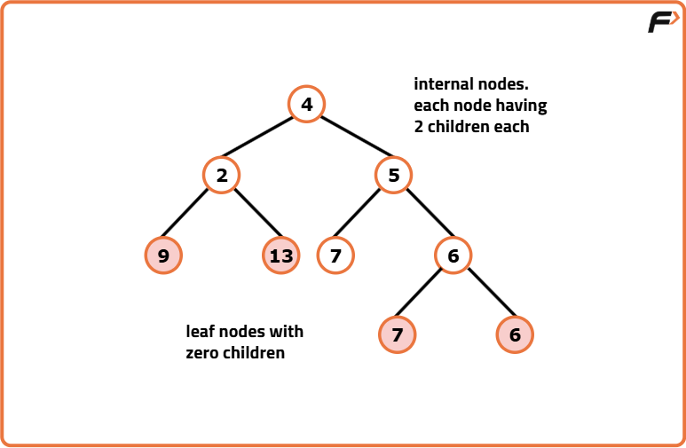
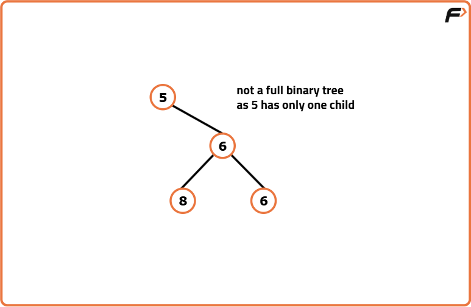

### B. Complete Binary Tree

**Definition:**  
- All levels are fully filled **except possibly the last**.  
- Nodes in the last level must be **as left as possible**.

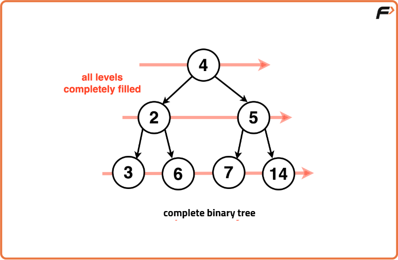
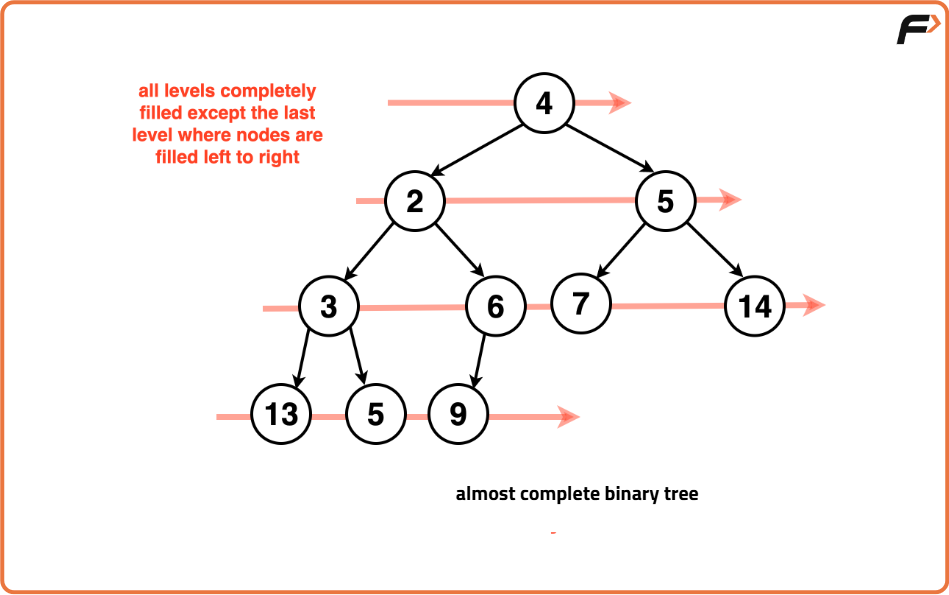
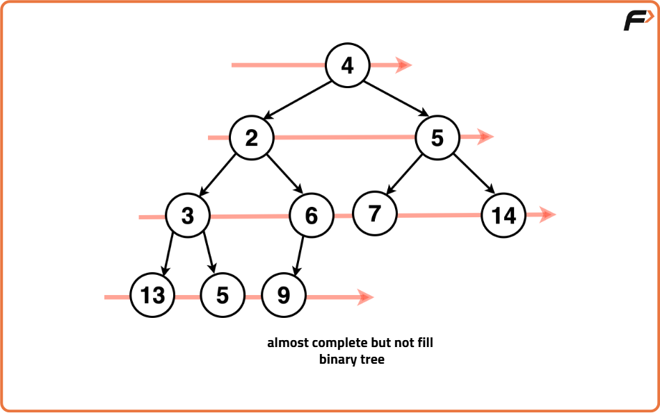

### C. Perfect Binary Tree

**Definition:**  
- All leaf nodes are at the **same level**.  
- All internal nodes have **2 children**.

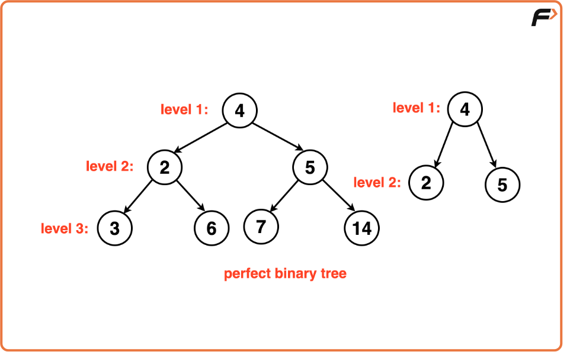

### D. Balanced Binary Tree

**Definition:**  
Height of the tree is approximately **O(log N)**.

Real-world interpretation (like AVL):  
Difference between heights of left & right subtree ≤ **1**.

Balanced trees ensure efficient operations like search.

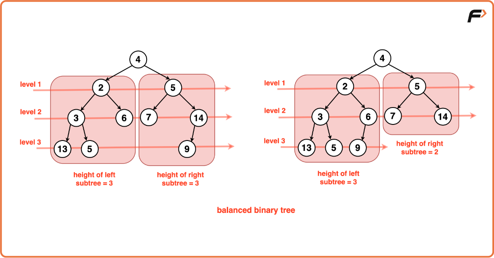
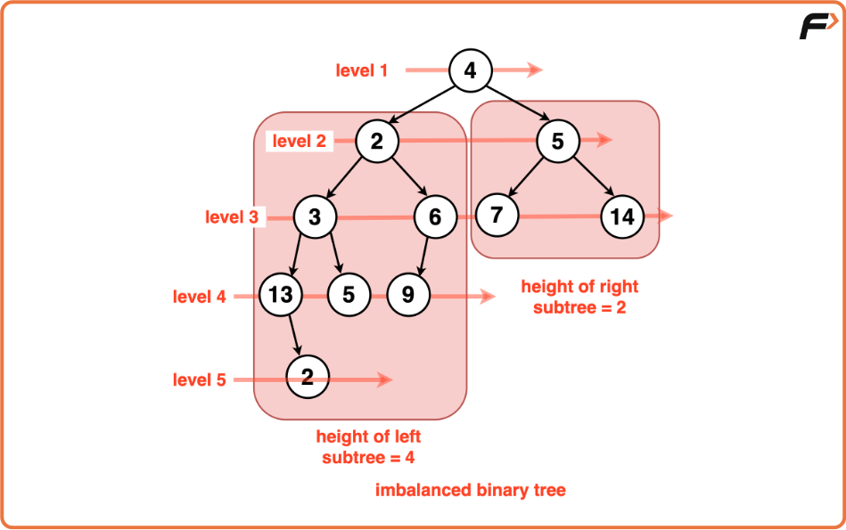

### E. Degenerate Tree

**Definition:**  
Every node has **exactly one child**.

This makes the tree behave like a **Linked List**.
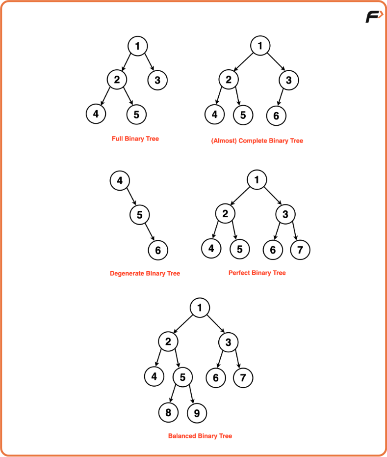
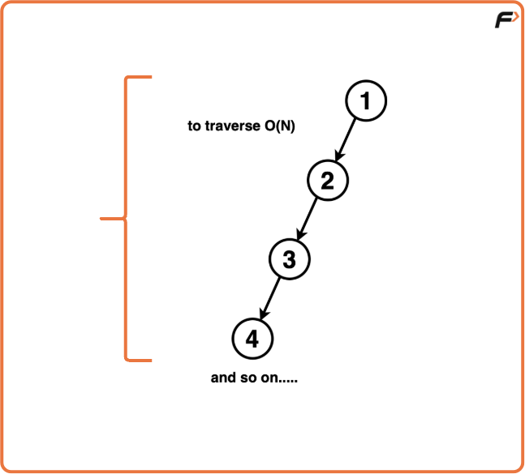

## 5. Important Observations & Key Points

### Full vs Complete Confusion
- **Full:** every node has 0 or 2 children  
- **Complete:** levels filled, last level left-aligned  

### Common Mistake  
A tree is **not complete** if a right child exists but the left child is missing on the same level.

### Why Are Trees Important in Interviews?

- Trees sit between linear structures and graphs.  
- Used for efficient searching (Binary Search Trees).  
- Form the base of many structures:  
  - Heaps  
  - Tries  
  - Segment Trees  
  - AVL & Red-Black Trees

---

## 6. Java Code for a Binary Tree Node

```java
// Structure of a Binary Tree Node in Java
class Node {
    int data;     // Value stored in the node
    Node left;    // Pointer to left child
    Node right;   // Pointer to right child

    // Constructor
    public Node(int value) {
        this.data = value;
        this.left = null;
        this.right = null;
    }
}

public class Main {
    public static void main(String[] args) {
        // Creating a root node
        Node root = new Node(1);

        // Attaching children
        root.left = new Node(2);
        root.right = new Node(3);

        // The tree now looks like:
        //        1
        //       / \
        //      2   3
    }
}
```

## 7. Summary


- Binary Tree → max 2 children

- Full Binary Tree → 0 or 2 children

- Complete Binary Tree → filled levels + left-aligned last level

- Perfect Binary Tree → all leaves at same level

- Balanced Binary Tree → height ≈ log(N)

- Degenerate Tree → every node has one child

- Ancestors → nodes from a given node to the root