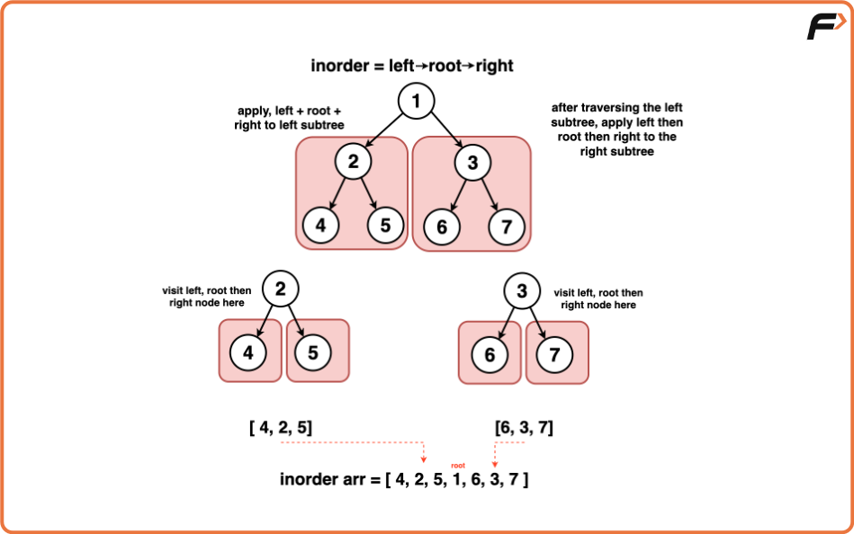
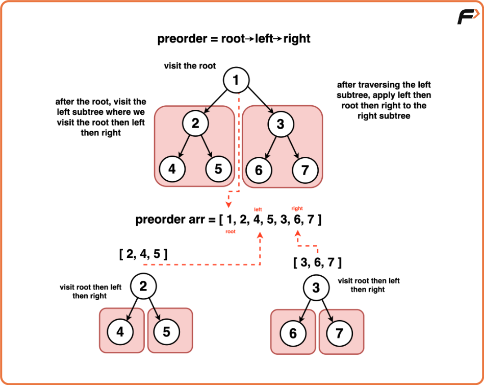
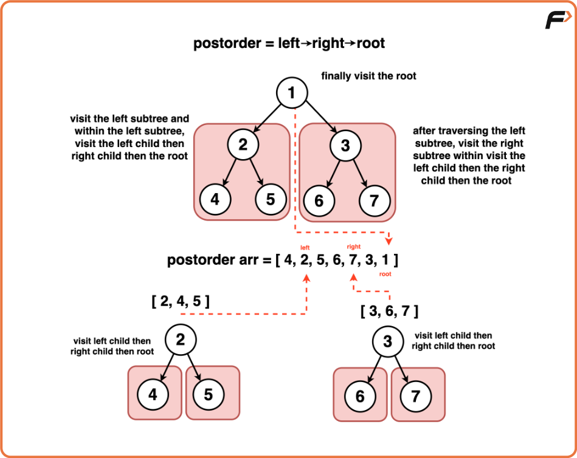
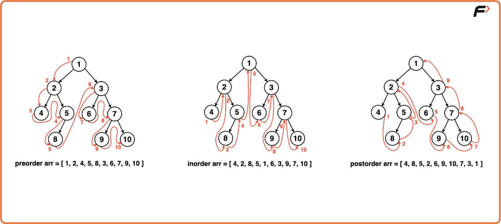
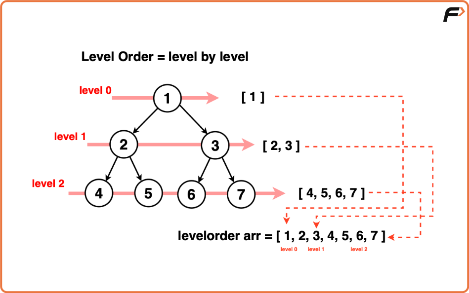

# 3. Binary Tree Traversals (DFS & BFS)

## 1. Why Do We Need Traversals?

To solve any tree-related problem (searching, checking properties, modifying structure), we must be able to **visit every node** in the tree.

Two main traversal categories:

- **DFS (Depth-First Search)**
- **BFS (Breadth-First Search)**


## 2. DFS (Depth-First Search)

DFS goes **deep down one branch** before backtracking.

DFS has **three major types** of traversal:

### A. Inorder Traversal (Left → Root → Right)

**Rule:**  
1. Visit left subtree  
2. Visit root  
3. Visit right subtree  

**Mnemonic:**  
“Inorder → Root is in the middle.”

### B. Preorder Traversal (Root → Left → Right)

**Rule:**  
1. Visit root  
2. Visit left subtree  
3. Visit right subtree  

**Mnemonic:**  
“Preorder → Root comes PRE (before) everything.”

### C. Postorder Traversal (Left → Right → Root)

**Rule:**  
1. Visit left subtree  
2. Visit right subtree  
3. Visit root  

**Mnemonic:**  
“Postorder → Root comes POST (after) everything.”

## 3. BFS (Breadth-First Search)

Also called **Level-Order Traversal**.

**Concept:**  
Visit the tree **level by level**, starting from root, then level 1, level 2, etc.

**Direction:**  
Left to Right within the same level.

## 4. Sample Tree 
```
    1
   / \
  2   3
 / \ / \
4  5 6  7
```

## 5. DFS Traversal Examples on This Tree

### Inorder (Left → Root → Right)



Steps:
- Go to 1 → left (2) → left (4) → print 4
- Back to 2 → print 2
- Go to 2 → right (5) → print 5
- Back to 1 → print 1
- Go to 1 → right (3) → left (6) → print 6
- Back to 3 → print 3
- Go to 3 → right (7) → print 7  

**Result:**  
`4, 2, 5, 1, 6, 3, 7`

### Preorder (Root → Left → Right)



Steps:
- Print 1  
- Go left: print 2  
- Go left: print 4  
- Backtrack → print 5  
- Go right: print 3  
- Print 6  
- Print 7  

**Result:**  
`1, 2, 4, 5, 3, 6, 7`

### Postorder (Left → Right → Root)



Steps:
- Go left → 4 → print 4  
- Go right → 5 → print 5  
- Print 2  
- Go right subtree → 6 → print 6  
- 7 → print 7  
- Print 3  
- Print 1  

**Result:**  
`4, 5, 2, 6, 7, 3, 1` ✔️



## 6. BFS Traversal Example




## 7. Important Observations & Key Points

### Subtree Concept
When you go “Left”, that node becomes the **new root** of its own subtree.  
Apply the traversal pattern again recursively.

### BFS vs DFS
- **BFS** → broad and level-wise  
- **DFS** → deep and branch-wise  

### Time Complexity  
O(N)

### Space Complexity  
O(N)  
(Stack space for DFS / queue space for BFS)